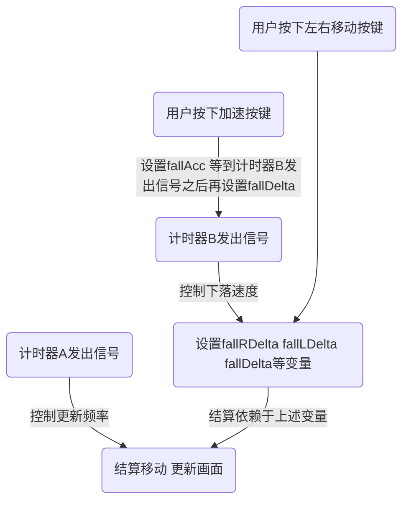
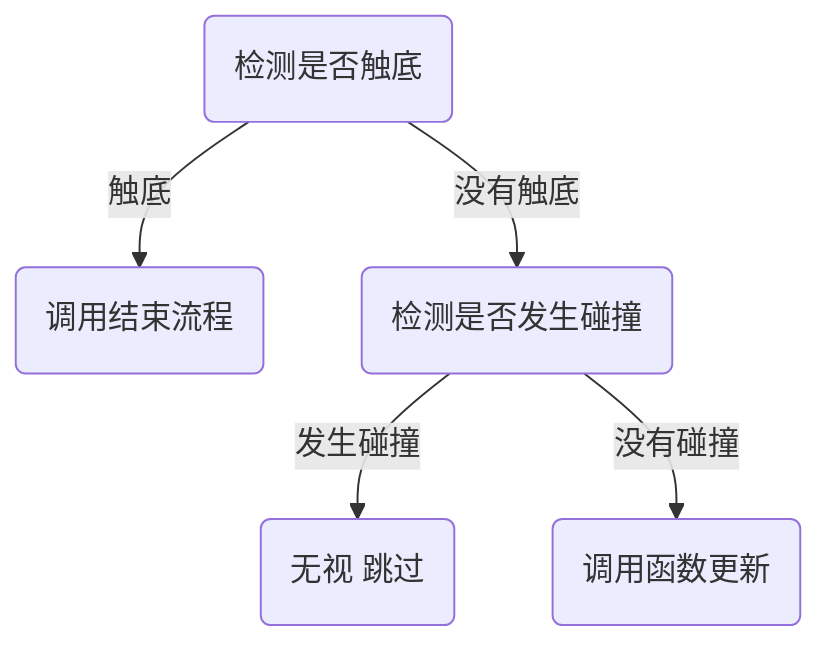

# AsmTetris

## 移动控制

```mermaid
graph TB;
  A(计时器A发出信号)--控制更新频率-->B(结算移动 更新画面);
  C(计时器B发出信号)--控制下落速度-->E(设置fallRDelta fallLDelta fallDelta等变量);
  F(用户按下左右移动按键)---->E;
  G(用户按下加速按键)--设置fallAcc 等到计时器B发出信号之后再设置fallDelta-->C;
  E --结算依赖于上述变量--> B;
```

```mermaid
graph TB
    A(检测是否触底) --触底--> B(调用结束流程);
    A --没有触底--> C(检测是否发生碰撞);
    C --发生碰撞--> D(无视 跳过);
    C --没有碰撞--> E(调用函数更新);

```